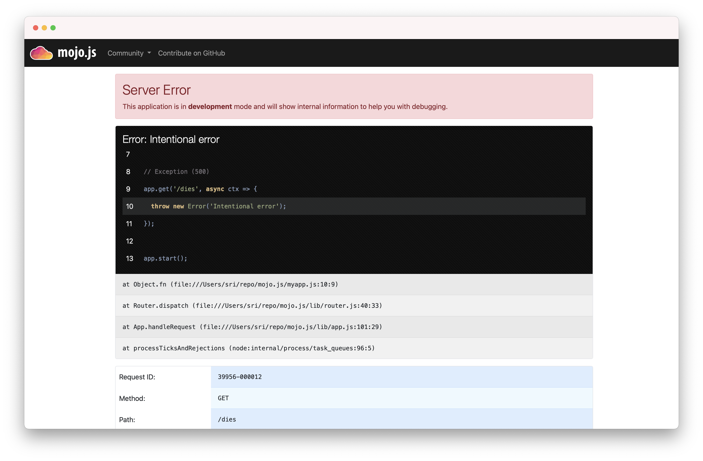

# Introduction

A quick example-driven introduction to the wonders of [mojo.js](https://mojojs.org).

### Two Variants

At its heart [mojo.js](https://mojojs.org) is an MVC framework, loosely following the
[architectural pattern](https://en.wikipedia.org/wiki/Model%E2%80%93view%E2%80%93controller). That means it wants you to
cleanly separate the parts of your web application into Models, Views and Controllers. On the file system that is
reflected as separate directories and files for different concerns.

```
`--blog
   |-- controllers
   |   |-- users.js
   |   `-- posts.js
   |-- models
   |   |-- users.js
   |   `-- posts.js
   |-- public
   |   `-- app.css
   |-- views
   |   |--layouts
   |   |  `-- default.html.tmpl
   |   `-- posts
   |       `-- list.html.tmpl
   |-- config.json
   `-- index.js
```

The `.js` files (or `.ts` if you're using [TypeScript](https://www.typescriptlang.org)) can also be moved into a `src`
`dist`, or `lib` directory to help with transpiling. What these files actually look like we will cover in detail later
on in another guide. For now it is just important for you to know that this is considered the ideal structure for a
[mojo.js](https://mojojs.org) application. Because for the remainder of this guide we will be using a second variant.

```
`-- blog.js
```

For tasks like prototyping and documentation examples, clean abstraction with many different files can be a little
distracting. So [mojo.js](https://mojojs.org) can also be used for single file applications. And these single file apps
can later on smoothly transition to proper MVC abstraction as they grow. This is one of the fundamental
[mojo.js](https://mojojs.org) design philosophies.

### Installation

All you need to get started with [mojo.js](https://mojojs.org) is [Node.js](https://nodejs.org) 16.0.0 (or newer). We
do recommend the use of an [nvm](https://nvm.sh) environment though.

```
$ mkdir myapp
$ cd myapp
$ npm install @mojojs/core
...
```

Be aware that [mojo.js](https://mojojs.org) uses [ES modules](https://nodejs.org/api/esm.html), so your `package.json`
should include a `"type": "module"`. Or you have to use the `.mjs` file extension instead of `.js`.

```json
{
  "type": "module",
  "dependencies": {
    "@mojojs/core": "^1.0.0"
  }
}
```

### Hello World

A simple Hello World application looks like this. Save it into a file `myapp.js` and you already got a fully functional
web application. The whole framework was specifically designed with `async`/`await` in mind, so almost everything
returns a `Promise`.

```js
import mojo from '@mojojs/core';

const app = mojo();

app.get('/', async ctx => {
  await ctx.render({text: 'Hello World!'});
});

app.start();
```

There is also a helper command available to generate a small example application for you.

```
$ npm create @mojojs/lite-app
...
```

### Commands

Many different commands are automatically available from the command line.

```
$ node myapp.js server
[39028] Web application available at http://127.0.0.1:3000/

$ node myapp.js server -l http://*:8080
[39029] Web application available at http://127.0.0.1:8080/

$ node myapp.js get /
Hello World!

$ node myapp.js --help
...List of available commands...

$ node myapp.js server --help
...List of available options for server command...
```

The `app.start()` call, which is usually the last statement in your application, starts the command system.

### Reloading

During development you don't want to restart your web server after every change, so we recommend the use of
[nodemon](https://www.npmjs.com/package/nodemon).

```
$ npm install nodemon
...

$ npx nodemon myapp.js server
...
[39248] Web application available at http://127.0.0.1:3000/
```

### Routes

Routes are basically just fancy paths that can contain different kinds of placeholders and usually lead to an action, if
they match the path part of the request URL. The first argument passed to all actions (`ctx`) is a context object,
containing both the HTTP request and response.

```js
import mojo from '@mojojs/core';

const app = mojo();

// Route leading to an action that renders some text
app.get('/foo', async ctx => {
  await ctx.render({text: 'Hello World!'});
});

app.start();
```

Response content is almost always generated by actions with a `ctx.render()` call, but more about that later.

### GET and POST Parameters

All `GET` and `POST` parameters sent with the request are accessible via `ctx.params()`, which returns a `Promise` that
resolves with a [URLSearchParams](https://nodejs.org/api/url.html#url_class_urlsearchparams) object.

```js
import mojo from '@mojojs/core';

const app = mojo();

// GET /foo?user=sri
app.get('/foo', async ctx => {
  const params = await ctx.params();
  const user = params.get('user');
  await ctx.render({text: `Hello ${user}.`});
});

app.start();
```

And for a little more control there are also methods to retrieve parameters separately.

```js
// Query parameters
const params = ctx.req.query();

// "application/x-www-form-urlencoded" or "multipart/form-data"
const params = await ctx.req.form();
```

### Stash and Views

`ctx.stash` is a plain object you can use to pass along arbitrary information. It is used primarily for data to be
included in the output of views. And while views can be inlined for single file apps, they are usually kept as
separate files in a `views` directory.

```js
import mojo from '@mojojs/core';

const app = mojo();

// Route leading to an action that renders a view
app.get('/foo', async ctx => {
  ctx.stash.one = 23;
  await ctx.render({inline: magicTemplate}, {two: 24});
});

app.start();

const magicTemplate = `
The magic numbers are <%= one %> and <%= two %>.
`;
```

The default [mojo.js](https://mojojs.org) template engine is
[@mojojs/template](https://www.npmjs.com/package/@mojojs/template), but any other template system can be integrated,
and will work just as well.

### HTTP

The `ctx.req` and `ctx.res` properties of the context object give you full access to all HTTP features and information.

```js
import mojo from '@mojojs/core';

const app = mojo();

// Access request information
app.get('/agent', async ctx => {
  const host = ctx.req.get('Host');
  const ua = ctx.req.get('User-Agent');
  await ctx.render({text: `Request by ${ua} reached ${host}.`});
});

// Echo the request body and send custom header with response
app.get('/agent', async ctx => {
  ctx.res.set('X-Bender', 'Bite my shiny metal ass!');
  const content = await ctx.req.text();
  await ctx.render({text: content});
});

app.start();
```

Take a look at the [Cheatsheet](Cheatsheet.md) to get a more complete overview of what properties and methods are
available.

### JSON

Of course there is first class support for JSON as well.

```js
import mojo from '@mojojs/core';

const app = mojo();

// Modify the received JSON object and return it
app.put('/add/quote', async ctx => {
  const data = await ctx.req.json();
  data.quote = "I don't remember ever fighting Godzilla... But that is so what I would have done!";
  await ctx.render({json: data});
});

app.start();
```

You can test all these examples right from the command line with the `get` command.

```
$ node myapp.js get -X PUT -b '{"hello":"mojo"}' /add/quote
```

### Built-in Exception and Not Found Pages

During development you will encounter these pages whenever you make a mistake, they are gorgeous and contain a lot of
valuable information that will aid you in debugging your application.

```js
import mojo from '@mojojs/core';

const app = mojo();

// Not found (404)
app.get('/missing', async ctx => ctx.notFound());

// Exception (500)
app.get('/dies', async ctx => {
  throw new Error('Intentional error');
});

app.start();
```



Don't worry about revealing too much information on these pages, they are only available during development, and
will be replaced automatically with pages that don't reveal any sensitive information in a production environment.


And of course they can be customised as well.

### Route Names

All routes can have a name associated with them, this allows backreferencing with methods like `ctx.urlFor()`. Nameless
routes get an automatically generated name assigned, based on the route pattern.

```js
import mojo from '@mojojs/core';

const app = mojo();

// Render an inline view with links to named routes
app.get('/').to(ctx => ctx.render({inline: inlineTemplate})).name('one');

// Render plain text
app.get('/another/page').to(ctx => ctx.render({text: 'Page two'})).name('two');

app.start();

const inlineTemplate = `
<a href="<%= ctx.urlFor('one') %>">One</a>
<a href="<%= ctx.urlFor('two') %>">Two</a>
`;
```

### Layouts

Layouts are special views that wrap around the result of another view, which is made available as `ctx.content.main` in
the layout. Here we use the inline variant again for our single file app, but layouts are usually kept as separate
files in a `views/layouts` directory.

```js
import mojo from '@mojojs/core';

const app = mojo();

// Render an inline view with an inline layout
app.get('/', ctx => ctx.render({inline: indexTemplate, inlineLayout: defaultLayout}, {title: 'Hello'}));

app.start();

const indexTemplate = `
Hello World!
`;

const defaultLayout = `
<!DOCTYPE html>
<html>
  <head>
    <title><%= title %></title>
  </head>
  <body><%= ctx.content.main %></body>
</html>
`;
```

The rendering guide will cover this in much more detail.

### Helpers

Helpers are little functions you can create with `app.addHelper()` and reuse throughout your whole application via the
context (`ctx`), from actions to views.

```js
import mojo from '@mojojs/core';

const app = mojo();

// A helper to identify visitors
app.addHelper('whois', ctx => {
  const agent = ctx.req.get('User-Agent') ?? 'Anonymous';
  const ip = ctx.req.ip;
  return `${agent} (${ip})`;
});

// Use helper in action and template
app.get('/secret', async ctx => {
  const user = ctx.whois();
  ctx.log.debug(`Request from ${user}`);
  await ctx.render({inline: indexTemplate});
});

app.start();

const indexTemplate = `
We know who you are <%= ctx.whois() %>.
`;
```

While helpers themselves can be redefined to change the behaviour of your application, they cannot overload properties
inherited from the prototype chain of the context object. So core [mojo.js](https://mojojs.org) functionality is
protected.

### Plugins

Plugins are application extensions that help with code sharing and organization. They are distributed as NPM modules or
as part of your application. You can register plugins with `app.plugin()`.

```js
import mojo, {jsonConfigPlugin} from '@mojojs/core';

// Create application with default configuration
const app = mojo({config: {foo: 'default value'}});

app.plugin(jsonConfigPlugin, {file: 'myapp.conf'});

// Return configured foo value
app.get('/foo', async ctx => {
  const foo = ctx.config.foo;
  await ctx.render({json: {foo}});
});

app.start();
```

Now if you create a `myapp.conf` file in the same directory as your application, you can change the `default value`.

```json
{
  "foo": "another value"
}
```

`jsonConfigPlugin` is a built-in plugin that ships with [mojo.js](https://mojojs.org) and which can populate
`app.config` using a config file (`config.json` by default). For multiple config files you can register it more than
once. Plugins can also set up routes, hooks, helpers, template engines and many many other things we will later explore
in the plugin guide.

### Placeholders

Route placeholders allow capturing parts of a request path until a `/` or `.` separator occurs, similar to the regular
expression `([^/.]+)`. Results are accessible via `ctx.stash`.

```js
import mojo from '@mojojs/core';

const app = mojo();

// GET /foo/test
// GET /foo/test123
app.get('/foo/:bar', async ctx => {
  const bar = ctx.stash.bar;
  await ctx.render({text: `Our :bar placeholder matched ${bar}.`});
});

// GET /testsomething/foo
// GET /test123something/foo
app.get('/<:bar>something/foo', async ctx => {
  const bar = ctx.stash.bar;
  await ctx.render({text: `Our :bar placeholder matched ${bar}.`});
});

app.start();
```

To separate them from the surrounding text, you can surround your placeholders with `<` and `>`, which also makes the
colon prefix optional.

### Relaxed Placeholders
Relaxed placeholders allow matching of everything until a `/` occurs, similar to the regular expression `([^/]+)`.

```js
import mojo from '@mojojs/core';

const app = mojo();

// GET /hello/test
// GET /hello/test.html
app.get('/hello/#you', async ctx => {
  const you = ctx.stash.you;
  await ctx.render({text: `Your name is ${you}.`});
});

app.start();
```

### Wildcard Placeholders

Wildcard placeholders allow matching absolutely everything, including `/` and `.`, similar to the regular expression
`(.+)`.

```js
import mojo from '@mojojs/core';

const app = mojo();

// GET /hello/test
// GET /hello/test123
// GET /hello/test.123/test/123
app.get('/hello/*you', async ctx => {
  const you = ctx.stash.you;
  await ctx.render({text: `Your name is ${you}.`});
});

app.start();
```

### HTTP Methods

Routes can be restricted to specific request methods with different methods like `app.get()`, `app.post()` and
`app.any()`.

```js
import mojo from '@mojojs/core';

const app = mojo();

// GET /hello
app.get('/hello', async ctx => {
  await ctx.render({text: 'Hello World!'});
});

// PUT /hello
app.get('/hello', async ctx => {
  const size = Buffer.byteLengt(await ctx.req.buffer());
  await ctx.render({text: `You uploaded ${size} bytes to /hello.`});
});

// GET|POST|PATCH /bye
app.any(['GET', 'POST', 'PATCH'], '/bye', async ctx => {
  await ctx.render({text: 'Bye World!'});
});

// * /whatever
app.any('/whatever', async ctx => {
  const method = ctx.req.method;
  await ctx.render({text: `You called /whatever with ${method}.`});
});

app.start();
```

### Optional Placeholders

All placeholders require a value, but by assigning them default values you can make capturing optional. Methods like
`app.get()` return a route object, which has a `route.to()` method that can be used to manually assign default values.

```js
import mojo from '@mojojs/core';

const app = mojo();

// GET /hello
// GET /hello/Sara
app.get('/hello/:name').to({name: 'Sebastian', day: 'Monday'}, async ctx => {
  const name = ctx.stash.name;
  const day = ctx.stash.day;
  await ctx.render({text: `My name is ${name} and it is ${day}.`});
});

app.start();
```

Default values that don't belong to a placeholder simply get merged into `ctx.stash` all the time.

### Restrictive Placeholders

A very easy way to make placeholders more restrictive are alternatives, you just make a list of possible values.

```js
import mojo from '@mojojs/core';

const app = mojo();

// * /test
// * /123
app.any('/:foo', {foo: ['test', '123']}, async ctx => {
  const foo = ctx.stash.foo;
  await ctx.render({text: `Our :foo placeholder matched ${foo}.`});
});

app.start();
```

All placeholders get compiled to a regular expression internally, this process can also be customized. Just make sure
not to use `^` and `$`, or capturing groups `(...)`, non-capturing groups `(?:...)` are fine though.

```js
import mojo from '@mojojs/core';

const app = mojo();

// * /1
// * /123
app.any('/:bar', {bar: /\d+/}, async ctx => {
  const bar = ctx.stash.bar;
  await ctx.render({text: `Our :bar placeholder matched ${bar}.`});
});

app.start();
```

You can take a closer look at all the generated regular expressions with the `routes` command.

```
$ node myapp.js routes -v
```

### Nested Routes

Routes can be nested in tree structures to organize them more efficiently and to share default values between branches.
All methods for creating new routes, like `app.get()`, are therefore also available as `route.get()`.

```js
import mojo from '@mojojs/core';

const app = mojo();

// * /foo (cannot match on its own)
const foo = app.any('/foo').to({name: 'Daniel'});

// GET /foo/bar
foo.get('/bar', async ctx => {
  const name = ctx.stash.name;
  await ctx.render({text: `My name is ${name}.`});
});

// GET /foo/baz
foo.get('/baz', async ctx => {
  const name = ctx.stash.name;
  await ctx.render({text: `My name is also ${name}.`});
});

app.start();
```

Only the actual endpoints of a route can match, so a request for `/foo` would not yield a result.

### Under

Authentication and code shared between multiple routes can be realized easily with routes created by `app.under()`. All
nested routes are only evaluated if the action returns a value other than `false`.

```js
import mojo from '@mojojs/core';

const app = mojo();

// Authenticate based on name parameter
const admin = app.under('/admin', async ctx => {

  // Authenticated
  const params = await ctx.params();
  if (params.get('name') === 'Bender') return;

  // Not authenticated
  await ctx.render({text: 'You are not Bender, permission denied.'});
  return false;
});

// GET /admin?name=Bender
admin.get('/', async ctx => {
  await ctx.render({text: 'Hi Bender!'});
});

app.start();
```

### Extensions

File extensions can be captured as well with the special `ext` route placeholder. Just use a restrictive placeholder to
declare possible values.

```js
import mojo from '@mojojs/core';

const app = mojo();

// GET /detect.html
// GET /detect.txt
app.get('/detect', {ext: ['html', 'txt']}, async ctx => {
  const ext = ctx.stash.ext;
  await ctx.render({text: `Detected .${ext} extension.`});
});

app.start();
```

And just like with placeholders you can use a default value to make the extension optional.

```js
import mojo from '@mojojs/core';

const app = mojo();

// GET /detect
// GET /detect.htm
// GET /detect.html
app.get('/detect', {ext: /html?/}).to({ext: 'html'}, async ctx => {
  const ext = ctx.stash.ext;
  await ctx.render({text: `Detected .${ext} extension.`});
});

app.start();
```

### Static Files

Static files will be served automatically from the `public` directory of your application if it exists. All static URLs
have a `/static` prefix by default, to make it easier to integrate reverse proxy servers in production environments.

```
$ mkdir public
$ echo 'Hello World!' > public/test.txt
```

Since the prefix is configurable, `ctx.urlForFile()` can be used to generate the URL.

```js
import mojo from '@mojojs/core';

const app = mojo();

// Redirect to static file
app.get('/file', async ctx => {
  const url = ctx.urlForFile('test.txt');
  await ctx.redirectTo(url, {status: 301});
});

app.start();
```

For `GET` and `HEAD` requests static files have a higher precedence than routes. Content negotiation with `Range`,
`If-None-Match` and `If-Modified-Since` headers is supported as well, and can be tested very easily with the `get`
command.

```
$ node myapp.js get /test -v -H 'Range: bytes=2-4'
```

### External Views

The renderer will seach for views in the `views` directory of your application if it exists. And for layouts in the
`views/layouts` subdirectory.

```
$ mkdir -p views/layouts
```
```
%# views/hello.html.tmpl
Hello <%= name %>!
```
```
%# views/layouts/default.html.tmpl
<!DOCTYPE html>
<html>
  <head>
    <title><%= title %></title>
  </head>
  <body><%= ctx.content.main %></body>
</html>
```

All views are expected to be in the format `name.format.engine`, such as `list.html.tmpl`. The `format` and `engine`
values are used to select the correct MIME type and template engine.

```js
import mojo from '@mojojs/core';

const app = mojo();

// Render a view "views/hello.html.tmpl" with layout "views/layouts/default.html.tmpl"
app.get('/', async ctx => {
  await ctx.render({view: 'hello', layout: 'default'}, {title: 'Hello', name: 'Isabell'});
});

app.start();
```

### Validation

Instead of form validation we use [JSON Schema](https://json-schema.org) data structure validation with
[ajv](https://www.npmjs.com/package/ajv) for everything.

```js
import mojo from '@mojojs/core';

const app = mojo();

// GET /form?test=13
app.get('/form', async ctx => {

  // Prepare validation function for schema
  const validate = ctx.schema({
    $id: 'testForm',
    type: 'object',
    properties: {
      test: {type: 'number'}
    },
    required: ['test']
  });

  // Turn request parameters into a plain object
  const params = await ctx.params();
  const testData = params.toObject();

  // Validate request parameters
  const result = validate(testData);
  if (result.isValid === true) {
    await ctx.render({json: testData});
  } else {
    await ctx.render({json: {error: {message: 'Validation failed'}}, status: 400});
  }
});

app.start();
```

Just remember to include an `$id` value, so the validation function can be cached. Or even better, register the schema
during application startup with `app.validator.addSchema()`.

```js
// Register schema
app.validator.addSchema({
  type: 'object',
  properties: {
    test: {type: 'number'}
  },
  required: ['test']
}, 'testForm');

// Request schema by name from now on
const validate = ctx.schema('testForm');
```

### Home

The directory in which the main application script resides, usually called `index.js`, is considered the application
home directory. For convenience it is available as `app.home`.

```
$ mkdir cache
$ echo 'Hello World!' > cache/hello.txt
```

The `Path` object provides many useful `fs.*` and `path.*` functions from Node.js, as well as some custom additions.

```js
import mojo from '@mojojs/core';

const app = mojo();

// Load message into memory
const hello = app.home.child('cache', 'hello.txt').readFileSync('utf8');

// Display message
app.get('/', async ctx => {
  await ctx.render({text: hello});
});

app.start();
```

### Conditions

Conditions such as `headers` and `host` are router extensions and allow for even more powerful route constructs.

```js
import mojo from '@mojojs/core';

const app = mojo();

// Firefox
app.get('/foo').requires('headers', {'User-Agent': /Firefox/}).to(async ctx => {
  await ctx.render({text: 'Congratulations, you are using a cool browser.'});
});

// http://mojolicious.org/bar
app.get('/bar').requires('host', /mojolicious\.org/).to(async ctx => {
  await ctx.render({text: 'Hello Mojolicious.'});
});

app.start();
```

Adding your own router extensions will be covered later in another guide.

### Sessions

Encrypted cookie based sessions just work out of the box, as soon as you start using them through `ctx.session()`. Just
be aware that all session data gets serialized as JSON.

```js
import mojo from '@mojojs/core';

const app = mojo();

// Access session data in action and template
app.get('/counter', async ctx => {
  const session = await ctx.session();

  if (session.counter === undefined) session.counter = 0;
  session.counter++;

  await ctx.render({inline: inlineCounter}, {session});
});

app.start();

const inlineCounter = `
Counter: <%= session.counter %>
`;
```

Note that you should use custom rotating secrets to make signed cookies really tamper resistant. Only the first secret
will be used to encrypt new cookies, but all of them to decrypt existing ones.

```js
app.secrets = ['My secret passphrase here'];
```

### File Uploads

Files uploaded with `multipart/form-data` requests are available via `ctx.req.files()`. They are not cached to disk, but
instead streamed as data arrives.

```js
import mojo from '@mojojs/core';

const app = mojo();

app.get('/', async ctx => ctx.render({inline: inlineForm}));

app.post('/upload', async ctx => {
  let bytes = 0;

  for await (const {fieldname, file, filename} of ctx.req.files()) {
    ctx.log.debug(`Uploading file ${filename}`);

    // Files are `stream.Readable` objects
    for await (const chunk of file) {
      const size =  Buffer.byteLength(chunk);
      bytes += size;
      ctx.log.debug(`${size} byte chunk uploaded`);
    }
  }

  await ctx.render({text: `${bytes} bytes uploaded.`});
});

app.start();

const inlineForm = `
<!DOCTYPE html>
<html>
  <head><title>Upload</title></head>
  <body>
    <form action="<%= ctx.urlFor('upload') %>" enctype="multipart/form-data" method="POST">
      <input name="example" type="file">
      <input type="submit" value="Upload">
    </form>
  </body>
</html>
`;
```

Just be aware that if you are also using `ctx.params()` or `ctx.req.form()`, they have to be called after
`ctx.req.files()`.

### User-Agent

While its primary purpose is testing, there is also a full featured HTTP and WebSocket user-agent available via
`ctx.ua`.

```js
import mojo from '@mojojs/core';

const app = mojo();

app.get('/', async ctx => {
  const params = await ctx.params();
  const url = params.get('url') ?? 'https://mojolicious.org';

  const res   = await ctx.ua.get(url);
  const html  = await res.html();
  const title = html.at('title').text();

  await ctx.render({text: title});
});

app.start();
```

For more information take a look at the [User-Agent](User-Agent.md) guide.

### WebSockets

WebSocket applications have never been this simple before. You can accept incoming connections with two methods,
`ctx.plain()` to receive and send messages unaltered, and `ctx.json()` to have messages automatically JSON encoded and
decoded.

```js
import mojo from '@mojojs/core';

const app = mojo();

app.get('/', async ctx => ctx.render({inline: inlineTemplate}));

app.websocket('/echo', async ctx => {
  ctx.json(async ws => {
    for await (const message of ws) {
      message.hello = `echo: ${message.hello}`;
      ws.send(message);
    }
  });
});

app.start();

const inlineTemplate = `
<!DOCTYPE html>
<html>
  <head>
    <title>Echo</title>
    <script>
      var ws = new WebSocket('<%= ctx.urlFor('echo') %>');
      ws.onmessage = event => {
        document.body.innerHTML += JSON.parse(event.data).hello;
      };
      ws.onopen = event => {
        ws.send(JSON.stringify({hello: 'I ♥ mojo.js!'}));
      };
    </script>
  </head>
</html>
`;
```

### Modes

Every [mojo.js](https://mojojs.org) application has multiple operating modes, which can be selected with the `NODE_ENV`
environment variable.

```
NODE_ENV=production node myapp.js server
```

The default operating mode is `development`, which sets the log level of `app.log` and `ctx.log` to the lowest level
(`trace`). All other modes raise the level to `info`.

```js
import mojo from '@mojojs/core';

const app = mojo();

// Prepare mode specific message during startup
const msg = app.mode === 'development' ? 'Development!' : 'Something else!';

app.get('/', async ctx => {
  ctx.log.trace('Rendering mode specific message');
  await ctx.render({text: msg});
});

app.log.trace('Starting application');
app.start();
```

Mode changes also affect a few other aspects of the framework, such as the built-in exception and not_found pages. Once
you switch modes from `development` to `production`, no sensitive information will be revealed on those pages anymore.

### Testing

Testing you [mojo.js](https://mojojs.org) application is as easy as creating a `test` directory and filling it with
normal JavaScript tests like `test/basic.js`. Especially if you use [tap](https://www.npmjs.com/package/tap) and the
built-in test user-agent.

```js
import mojo from '@mojojs/core';

export const app = mojo();

app.get('/', async ctx => {
  await ctx.render({text: 'Welcome to mojo.js!'});
});

app.start();
```

Just make sure to export `app` from your application script.

```js
import {app} from '../myapp.js';
import t from 'tap';

t.test('Basics', async t => {
  const ua = await app.newTestUserAgent({tap: t});

  await t.test('Index', async t => {
    (await ua.getOk('/')).statusIs(200).bodyLike(/mojo.js/);
  });

  await ua.stop();
});
```

And run your tests as scripts or with `tap`.

```
$ node test/basic.js
$ node --test test/*.js
```

For more information take a look at the [User-Agent](User-Agent.md) guide.

## More

A lot more documentation and examples by many different authors can be found in the
[mojo.js wiki](https://github.com/mojolicious/mojo.js/wiki).

## Support

If you have any questions the documentation might not yet answer, don't hesitate to ask in the
[Forum](https://github.com/mojolicious/mojo.js/discussions), or on [IRC](https://web.libera.chat/#mojo).
