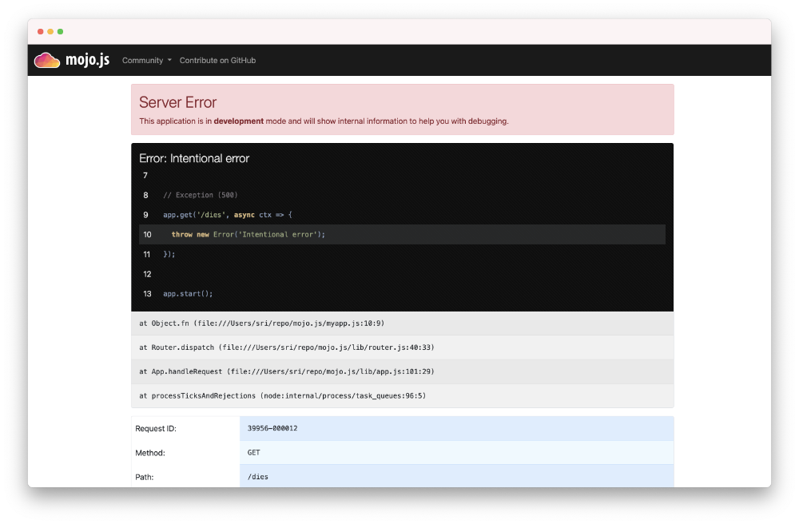

# Introduction to mojo.js

A quick example-driven introduction to the wonders of [mojo.js](https://mojojs.org).

## Two Variants

At its heart mojo.js is an MVC framework, loosely following the
[architectural pattern](https://en.wikipedia.org/wiki/Model%E2%80%93view%E2%80%93controller). That means it wants you to
cleanly separate the parts of your web application into Models, Views and Controllers. On the file system that is
reflected as separate directories and files for different concerns.

```
`-- blog
    |-- controllers
    |   |-- users.js
    |   `-- posts.js
    |-- models
    |   |-- users.js
    |   `-- posts.js
    |-- public
    |   `-- app.css
    |-- views
    |   |--layouts
    |   |  `-- default.html.ejs
    |   `-- posts
    |       `-- list.html.ejs
    |-- config.json
    `-- index.js
```

What these files actually look like we will cover in detail later on in another guide. For now it is just important for
you to know that this is considered the ideal structure for a mojo.js application. Because for the remainder of this
guide we will be using a second variant.

```
`-- blog.js
```

For tasks like prototyping and documentantion examples, clean abstraction with many different files can be a little
distracting. So mojo.js can also be used for single file applications. And these single file apps can later on smoothly
transition to proper MVC abstraction as they grow. This is one of the fundamental mojo.js design philosophies.

## Installation

All you need to get started with mojo.js is [Node.js](https://nodejs.org) 15.0.0 (or newer). We do recommend the use of
an [nvm](https://nvm.sh) environment though.

```
$ npm install -g @mojojs/mojo
...
```

You can install mojo.js with `npm` globally, or in a project specific `node_modules` directory.

```
$ mkdir myapp
$ cd myapp
$ npm i @mojojs/mojo
...
```

Be aware that mojo.js uses [ES modules](https://nodejs.org/api/esm.html), so your `package.json` should include a
`"type": "module"`. Or you have to use the `.mjs` file extension instead of `.js`.

```json
{
  "type": "module",
  "dependencies": {
    "@mojojs/mojo": ">=0.0.1-alpha.21"
  }
}
```

## Hello World

A simple Hello World application looks like this. Save it into a file `myapp.js` and you already got a fully functional
web application. The whole framework was specifically designed with `async`/`await` in mind, so almost everything
returns a `Promise`.

```js
import mojo from '@mojojs/mojo';

const app = mojo();

app.get('/', async ctx => {
  await ctx.render({text: 'Hello World!'});
});

app.start();
```

There is also a helper command available to generate a small example application for you.

```
$ npx mojo gen-lite-app
...
```

## Commands

Many different commands are automatically available from the command line.

```
$ node myapp.js server
[39028] Web application available at http://127.0.0.1:3000/

$ node myapp.js server -l http://*:8080
[39029] Web application available at http://127.0.0.1:8080/

$ node myapp.js get /
Hello World!

$ node myapp.js --help
...List of available commands...
```

The `app.start()` call, which is usually the last statement in your application, starts the command system.


## Reloading

During development you don't want to restart your web server after every change, so we recommend the use of
[nodemon](https://www.npmjs.com/package/nodemon).

```
$ npm i nodemon
...

$ npx nodemon myapp.js server
...
[39248] Web application available at http://127.0.0.1:3000/
```

## Routes

Routes are basically just fancy paths that can contain different kinds of placeholders and usually lead to an action, if
they match the path part of the request URL. The first argument passed to all actions (`ctx`) is a context object,
containing both the HTTP request and response.

```js
import mojo from '@mojojs/mojo';

const app = mojo();

// Route leading to an action that renders some text
app.get('/foo', async ctx => {
  await ctx.render({text: 'Hello World!'});
});

app.start();
```

Response content is almost always generated by actions with a `ctx.render()` call, but more about that later.

## GET and POST Parameters

All `GET` and `POST` parameters sent with the request are accessible via `ctx.params()`, which returns a `Promise` that
resolves with a [URLSearchParams](https://nodejs.org/api/url.html#url_class_urlsearchparams) object.

```js
import mojo from '@mojojs/mojo';

const app = mojo();

// GET /foo?user=sri
app.get('/foo', async ctx => {
  const params = await ctx.params();
  const user = params.get('user');
  await ctx.render({text: `Hello ${user}.`});
});

app.start();
```

And for a little more control there are also methods to retrieve parameters separately.

```js
// Query parameters
const params = ctx.req.query();

// "application/x-www-form-urlencoded" or "multipart/form-data"
const params = await ctx.req.form();
```

## Stash and Views

The `stash` is a plain object and a property of the context object. It is used primarily to pass data to views. And
while views can be inlined for single file apps, they are usually kept as separate files in a `views` directory.

```js
import mojo from '@mojojs/mojo';

const app = mojo();

// Route leading to an action that renders a view
app.get('/foo', async ctx => {
  ctx.stash.one = 23;
  await ctx.render({inline: magicTemplate}, {two: 24});
});

app.start();

const magicTemplate = `
The magic numbers are <%= one %> and <%= two %>.
`;
```

The default mojo.js template engine is [ejs](https://www.npmjs.com/package/ejs), but any other template system can be
integrated, and will work just as well.

## HTTP

The `ctx.req` and `ctx.res` properties of the context object give you full access to all HTTP features and information.

```js
import mojo from '@mojojs/mojo';

const app = mojo();

// Access request information
app.get('/agent', async ctx => {
  const host = ctx.req.url.hostname;
  const ua = ctx.req.get('User-Agent');
  await ctx.render({text: `Request by ${ua} reached ${host}.`);
});

// Echo the request body and send custom header with response
app.get('/agent', async ctx => {
  ctx.res.set('X-Bender', 'Bite my shiny metal ass!');
  const content = await ctx.req.text();
  await ctx.render({text: content});
});

app.start();
```

Thake a look at the [Cheatsheet](Cheatsheet.md) to get a more complete overview of what properties and methods are
available.

## JSON

Of course there is first class support for JSON as well.

```js
import mojo from '@mojojs/mojo';

const app = mojo();

// Modify the received JSON object and return it
app.put('/add/quote', async ctx => {
  const data = await ctx.req.json();
  data.quote = "I don't remember ever fighting Godzilla... But that is so what I would have done!";
  await ctx.render({json: data});
});

app.start();
```

You can test all these examples right from the command line with the `get` command.

```
$ node myapp.js get -X PUT -b '{"hello":"mojo"}' /add/quote
```

## Built-in Exception and Not Found Pages

During development you will encounter these pages whenever you make a mistake, they are gorgeous and contain a lot of
valuable information that will aid you in debugging your application.

```js
import mojo from '@mojojs/mojo';

const app = mojo();

// Not found (404)
app.get('/missing', async ctx => ctx.notFound());

// Exception (500)
app.get('/dies', async ctx => {
  throw new Error('Intentional error');
});

app.start();
```



Don't worry about revealing too much information on these pages, they are only available during development, and
will be replaced automatically with pages that don't reveal any sensitive information in a production environment.


And of course they can be customised as well.

## Route Names

All routes can have a name associated with them, this allows backreferencing with methods like `ctx.urlFor()`. Nameless
routes get an automatically generated name assigned, based on the route pattern.

```js
import mojo from '@mojojs/mojo';

const app = mojo();

// Render an inline view with links to named routes
app.get('/').to(ctx => ctx.render({inline: inlineTemplate})).name('one');

// Render plain text
app.get('/another/page').to(ctx => ctx.render({text: 'Page two'})).name('two');

app.start();

const inlineTemplate = `
<a href="<%= ctx.urlFor('one') %>">One</a>
<a href="<%= ctx.urlFor('two') %>">Two</a>
`;
```

## Layouts

Layouts are special views that wrap around the result of another view, which is made available as `view.content` in the
layout. Here we use the inline variant again for out single file app, but layouts are usually kept as separate files in
a `views/layouts` directory.

```js
import mojo from '@mojojs/mojo';

const app = mojo();

app.get('/', ctx => ctx.render({inline: indexTemplate, inlineLayout: defaultLayout}, {title: 'Hello'}));

app.start();

const indexTemplate = `
Hello World!
`;

const defaultLayout = `
<!DOCTYPE html>
<html>
  <head>
    <title><%= title %></title>
  </head>
  <body><%- view.content %></body>
</html>
`;
```

The rendering guide will cover this in much more detail.

## Helpers

Helpers are little functions you can create with `app.addHelper()` and reuse throughout your whole application via the
context (`ctx`), from actions to views.

```js
import mojo from '@mojojs/mojo';

const app = mojo();

app.addHelper('whois', ctx => {
  const agent = ctx.req.get('User-Agent') ?? 'Anonymous';
  const ip = ctx.req.remoteAddress;
  return `${agent} (${ip})`;
});

app.get('/secret', async ctx => {
  const user = ctx.whois();
  ctx.log.debug(`Request from ${user}`);
  await ctx.render({inline: indexTemplate});
});

app.start();

const indexTemplate = `
We know who you are <%= ctx.whois() %>
`;
```

While helpers themselves can be redefined to change the behaviour of your application, they cannot overload properties
inherited from the prototype chain of the context object. So core mojo.js functionality is protected.

## Plugins

Plugins are application extensions that help with code sharing and organization. They are distributed as NPM modules or
as part of your application. You can register plugins with `app.plugin()`.

```js
import mojo from '@mojojs/mojo';

const app = mojo({config: {foo = 'default value'}});

app.plugin(mojo.jsonConfigPlugin, {file: '/etc/myapp.conf'});

// Return configured foo value
app.get('/foo', async ctx => {
  const foo = ctx.config.foo;
  await ctx.render({json: {foo}});
});

app.start();
```

`mojo.jsonConfigPlugin` is a built-in plugin that ships with mojo.js and which can populate `app.config` using a config
file (`config.json` in the application directory by default). Plugins can also set up routes, hooks, helpers, template
engines and many many other things we will later explore in the plugin guide.

## Placeholders

Route placeholders allow capturing parts of a request path until a `/` or `.` separator occurs, similar to the regular
expression `([^/.]+)`. Results are accessible via `ctx.stash`.

```js
import mojo from '@mojojs/mojo';

const app = mojo();

// GET /foo/test
// GET /foo/test123
app.get('/foo/:bar', async ctx => {
  const bar = ctx.stash.bar;
  await ctx.render({text: `Our :bar placeholder matched ${bar}`});
});

// GET /testsomething/foo
// GET /test123something/foo
app.get('/<:bar>something/foo', async ctx => {
  const bar = ctx.stash.bar;
  await ctx.render({text: `Our :bar placeholder matched ${bar}`});
});

app.start();
```

To separate them from the surrounding text, you can surround your placeholders with `<` and `>`, which also makes the
colon prefix optional.
